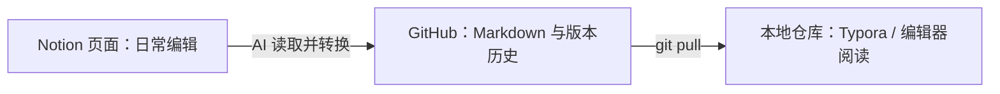

# 用 Notion + AI + GitHub 管理知识库：从云端编辑到本地同步

文档路径：`docs/dev-env/codex/windows-codex-notion-github-knowledge-workflow.md`

## 1. 这篇文档解决什么问题

把日常知识整理放在 Notion 中，再让 AI 把指定页面同步成 GitHub 中的 Markdown，最后拉取到电脑上的知识库。这样既能使用云端页面的阅读和编辑体验，也能保留 Git 的版本历史和本地文件。

本工作流采用一个明确约定：Notion 是日常编辑入口，GitHub 是 Markdown 备份与版本记录，本地仓库是拉取后的文件副本。每次同步由用户发起，当前没有部署自动同步或双向同步。

## 2. 三份内容之间的关系



- 在 Notion 桌面版改页面，保存的是 Notion 页面内容，不会直接修改本地仓库中的 `.md` 文件。
- Notion 离线编辑会先保存在设备上，联网后同步到 Notion；这仍然不等于同步到 GitHub。[Notion 官方离线说明](https://www.notion.com/help/use-pages-offline)
- AI 将页面提交到 GitHub 后，电脑上的文件仍需要拉取才会更新。
- 独立“同步记录”页中的 Markdown 附件是某次同步的文件快照。修改文章正文时，附件不会自动变成新版本。
## 3. AI 怎样连接 Notion

AI 通过已授权的 Notion 连接读取或编辑页面。Notion MCP 提供连接 AI 工具与 Notion 的方式，支持页面读写；实际能执行哪些动作，还取决于当前连接、工具能力和账号权限。[Notion MCP 官方说明](https://www.notion.com/help/notion-mcp)

在支持插件的 ChatGPT / Codex 环境中，MCP 工具可由插件提供。插件本身并不代表已经建立 GitHub 与 Notion 的持续同步。[OpenAI 插件说明](https://developers.openai.com/plugins/concepts/plugins)

本次会话已验证 Notion 连接具备读取、创建和修改页面的能力，并且 GitHub 连接可以读取指定仓库。

连接验证顺序：

1. 提供一个明确的 Notion 页面链接。
2. 让 AI 读取页面，确认标题、正文和父页面都正确。
3. 创建或修改指定页面，再回读确认写入结果。
4. 确认 GitHub 目标仓库、分支和文件路径，再执行同步。

如果换了 AI 客户端、Notion 工作区或账号，应重新验证实际读写能力，不要只凭“连接成功”判断可以完成整条流程。

## 4. 日常使用方式
1. 在 Notion 中新增文章、修改正文，或让 AI 按页面链接整理内容。
2. 修改完成后，明确告诉 AI 要同步哪篇文章，以及 GitHub 文件路径。
3. AI 重新读取 Notion 当前正文，将标题、段落、列表、引用和代码块转换为标准 Markdown。
4. AI 检查 GitHub 现有文件；新增文件用新增提交，修改文件先比较差异，避免覆盖另一侧的新内容。
5. 提交成功后，AI 或用户在本地仓库拉取，并核对文件内容。

适合直接使用的提示词：

```text
读取这篇 Notion 页面的最新正文，同步到 yunko1993/ai-knowledge-base 的 main 分支。
目标文件：docs/dev-env/codex/windows-codex-notion-github-knowledge-workflow.md。
保留标题、列表、代码块和路径信息，把已知仓库内文章的 Notion 链接转换为相对 Markdown 链接。
提交后在 C:\github\ai-knowledge-base 拉取并验证。
只同步我指定的内容，保留其他本地文件和未提交修改；遇到冲突先报告差异。
返回 Notion 页面、GitHub 文件和本地验证结果。
```

## 5. Notion 转 Markdown 时的约定
- 页面标题转换为 Markdown 第一行的一级标题。
- 正文按阅读顺序保留，代码块内容和语言标记保留。
- Notion 中指向已知仓库文章的链接，转换为该文件所在目录能解析的相对路径。
- 外部官方资料链接保留原网址。
- 原仓库路径写在正文中，方便后续准确同步。
- 同步记录、提交号和原文件附件统一放在知识库的独立“同步记录”页中；文章页面只保留标题和知识正文，与 GitHub、本地 Markdown 保持内容一致。
- 使用普通段落、标题、列表和代码块更便于跨平台保存；无法转换的 Notion 专有块需要单独处理并说明。

四份 `SKILL.md` 的 YAML frontmatter 需要在导出时恢复为文件开头的原格式。Notion 上的说明页面不会自动成为本地已安装的 skill。

## 6. 从 GitHub 拉取到本地

本次目标仓库：

```text
GitHub：yunko1993/ai-knowledge-base
分支：main
本地：C:\github\ai-knowledge-base
```

先检查当前分支、远程地址和未提交内容：

```powershell
git -C C:\github\ai-knowledge-base branch --show-current
git -C C:\github\ai-knowledge-base remote -v
git -C C:\github\ai-knowledge-base status --short
```

确认当前位置和分支正确、本地改动不会被覆盖后，使用仅允许快进的拉取：

```powershell
git -C C:\github\ai-knowledge-base pull --ff-only origin main
```

`git pull` 会获取远端修改并整合到本地；仅获取远端信息的 `git fetch` 不会直接更新当前工作目录。[GitHub 官方说明](https://docs.github.com/en/get-started/using-git/getting-changes-from-a-remote-repository)

如果 `--ff-only` 失败，说明不能直接快进，应先检查本地与远端差异。不要用强制重置或清理文件来跳过冲突。

## 7. 如何判断同步成功

同步后至少核对四件事：

1. Notion：页面位于预期目录，最新正文可以完整回读。
2. GitHub：目标文件存在，正文来自本次 Notion 回读结果，提交记录可查。
3. 本地：拉取成功，目标文件存在，本地分支已包含同步提交。
4. 一致性：GitHub 文件与本地文件在统一换行符后内容一致；标题、代码块和转换后的链接正确。

Windows 的 Git 设置可能在本地使用 CRLF，而 GitHub 文件使用 LF。比较文本时统一换行符，避免将格式差异误判为内容丢失；需要逐字节比较时，应明确采用同一种换行策略。

本地文件检查示例：

```powershell
Test-Path -LiteralPath 'C:\github\ai-knowledge-base\docs\dev-env\codex\windows-codex-notion-github-knowledge-workflow.md'
git -C C:\github\ai-knowledge-base log -1 --oneline
git -C C:\github\ai-knowledge-base status --short
```

## 8. 本篇的工作流验证

本篇先创建在 Notion 中，随后通过 Notion 工具回读正文，再生成 GitHub 文件，最后从远端拉取到本地仓库。

验证标记：`NOTION-GITHUB-LOCAL-2026-10-08-V1`

该标记用于检查最新 Notion 正文是否进入 GitHub 与本地文件。实际提交号、回读结果和本地核对结果，统一记录在知识库的独立“同步记录”页中。

## 9. 相关文档
- [Windows 下用 Codex + Obsidian + GitHub 管理知识库](windows-codex-obsidian-github-knowledge-workflow.md)

原有 Obsidian 工作流文档保留，便于对照本地编辑与 Notion 云端编辑的不同分工。

## 10. 维护约定

日常集中在 Notion 编辑，需要保存版本或供本地工具使用时，再明确发起同步。

如果也在本地修改同一篇文章，应先比对两侧修改并合并，再回写选定的主版本。GitHub 更新不会自动反向改 Notion，Notion 更新也不会自动上传 GitHub。

当前仓库是公开仓库。私人 Notion 页面的访问权限不会随 Markdown 文件一起传递，发布到该仓库的正文将成为公开内容。
